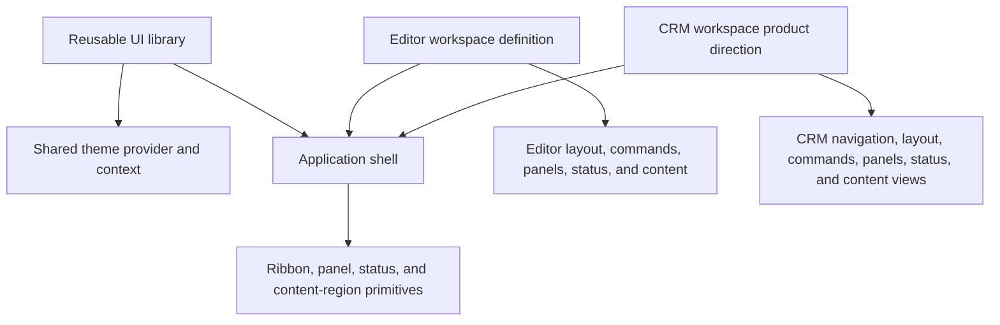

# Target Architecture: Reusable Shell and Workspaces

## Document status

This document records a user-defined target architecture. It does not describe the legacy demo's current state and is not a detailed implementation plan. Current-state facts remain in `current-architecture.md` and `schema-driven-ui-current-seams.md`.

## Target model

The UI library will provide a reusable application foundation rather than an editor-specific application. Its shared layer will include:

- An application shell that establishes the common workspace frame.
- A theme provider exposed through shared React context.
- Reusable layout-region primitives for the ribbon, left panel, right panel, status bar, and main content surface.
- Composition boundaries through which an application supplies its workspace-specific UI and behavior.

The shell defines the shared structure and theme boundary. It does not define editor commands, editor panels, document behavior, or another application's domain model.

## Workspace definitions

Application-specific experiences are separate workspace definitions or configurations. A workspace composes the library's reusable primitives and supplies its own:

- Ribbon tabs, groups, controls, and layout.
- Left-panel and right-panel contents.
- Status-bar contents.
- Command and event behavior.
- Main content experience.

The representation of a workspace configuration is intentionally unspecified here. This target does not yet decide the JSON shape, TypeScript API, registry contract, command payloads, state model, or persistence format.

## Current demo and target-workspace direction

The current RibbonUI demo is the Editor workspace in this target model. The likely concrete product direction is a CRM workspace with a classic-Outlook-inspired shell. This is a target-workspace descriptor, not current implementation.

The CRM workspace will provide a left-hand pop-out or tabbed navigation area for major sections, such as Contacts and Products. Its main workspace will present one active section at a time in a tabbed or section-oriented view.

| Concern | Editor workspace | CRM workspace (product direction) | Shared library responsibility |
| --- | --- | --- | --- |
| Navigation | Editor navigation defined by the Editor workspace | CRM-owned left-hand pop-out/tabbed entries for major sections | Navigation/panel-region primitives and shell placement |
| Ribbon | Editor-specific authoring and review layout | CRM-defined ribbon layout | Ribbon-region primitives and shell placement |
| Panels | Document navigation and editor settings | CRM-defined panels | Left/right panel-region primitives |
| Status bar | Document/page/editor status | CRM-defined status content | Status-bar region and composition boundary |
| Commands | Document editing and formatting commands | CRM-defined commands | Common command attachment boundary, not domain commands |
| Content | Editable document surface | One active CRM section in a tabbed or section-oriented main view | Main content-region primitive |
| Theme | Consumes shared theme context | Consumes shared theme context | Theme provider and shared context |

The CRM workspace owns its navigation entries, ribbon layout, panels, status content, commands, and content views while composing the shared library primitives and theme provider. This document does not define CRM entities, data models, workflows, persistence, or detailed behavior.

A Spreadsheet workspace remains an example of how the same shell could support another domain. It is not identified as the planned next workspace.

## Target boundaries

- Workspace configuration composes reusable primitives; it does not turn those primitives into editor-specific components.
- Domain behavior belongs to the workspace, not to the reusable shell.
- The theme provider and layout-region contracts are shared across workspaces.
- Different workspaces may supply different region contents while retaining the same shell foundation.
- Adding another workspace must not require the shared library to adopt that workspace's domain concepts.

## Deliberately deferred

This document does not define the implementation sequence, migration from the legacy demo, package layout, schema design, runtime registry, state ownership, action protocol, persistence, testing strategy, CRM data model or behavior, or delivery phases. Those decisions belong in a later implementation plan.
